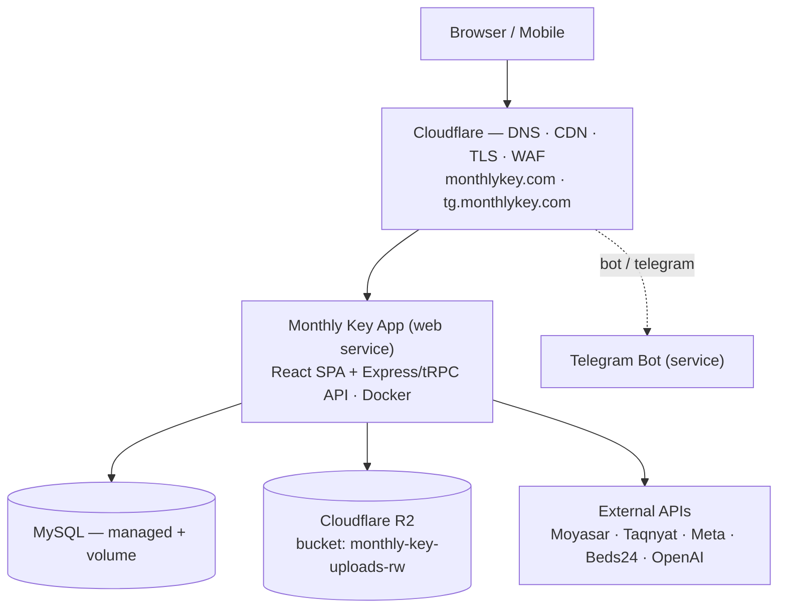
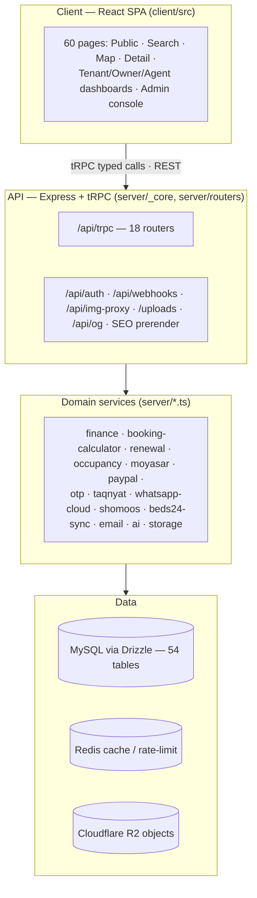
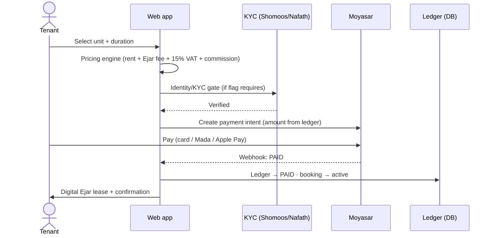

# Monthly Key — Platform Architecture

**المفتاح الشهري** — a furnished **monthly-rental marketplace for Saudi Arabia**. Tenants
search and book furnished apartments, studios, villas and hotel apartments; owners and
property managers list and manage inventory; an operations team runs bookings, payments,
maintenance, KYC and content from an admin console. Riyadh is live; Jeddah and Madinah are
staged as "coming soon".

This document describes the **production web platform** (the repository root: `client/` +
`server/` + `shared/`). It is the engineering companion to the visual handout.

---

## 1. At a glance

| | |
|---|---|
| **Frontend** | React 19, Vite 7, TypeScript, Wouter, tRPC + TanStack Query, Tailwind v4, Radix/shadcn, Leaflet |
| **Backend** | Node 22, Express 4, tRPC v11, Zod v4, Drizzle ORM, MySQL (mysql2), jose (JWT), bcryptjs |
| **Data** | MySQL — **54 tables**, **26 migrations** (drizzle-kit); Redis for cache/rate-limit |
| **Storage** | Cloudflare R2 (S3-compatible) — property photos, KYC documents |
| **Hosting** | Railway (Docker) — 3 services; Cloudflare for DNS/CDN/TLS |
| **API** | tRPC — **18 routers** at `/api/trpc`, plus Express routes for auth, webhooks, media, SEO |
| **Languages** | Arabic-first (RTL) + English, runtime-configurable |

One TypeScript codebase end-to-end; the client and server **share types and Zod schemas**,
and the tRPC boundary makes API calls type-safe from the React component to the DB query.

---

## 2. Deployment topology

A single Railway project hosts three services behind Cloudflare. The web service serves both
the SPA and the API from one container.

**Boot sequence** (`start.sh`): validate DB URL → column safety-check → run Drizzle migrations
→ start the esbuild-bundled server. Integration credentials (payments, WhatsApp, R2) are
loaded from the database at boot and injected into the process — most third-party config is
managed **at runtime** via the admin Integrations panel, not baked into the image.

---

## 3. Application layers

The type-safe boundary is **tRPC**: the client calls procedures as typed functions;
validation, authentication and rate-limiting run in middleware before any domain code.

---

## 4. API surface

### tRPC routers (`/api/trpc`)

| Router | Responsibility | Access |
|--------|----------------|--------|
| `property`, `geo` | Listings, search, map data, featured, public stats; cities & districts | public |
| `auth`, `user`, `roles` | Login/register, OTP, sessions, profile, RBAC roles & permissions | mixed |
| `booking`, `payment` | Booking lifecycle, pricing, Moyasar intents, payment status | protected |
| `finance` | Immutable payment ledger, KPIs, renewals, unit finance | admin |
| `lease`, `maintenance` | Ejar contracts; maintenance requests & updates | protected |
| `manager`, `submission` | Property-manager directory; owner listing submissions & review | mixed |
| `notification` | WhatsApp send/templates, contact form, push, in-app notifications | mixed |
| `cms` | Runtime site content, media, versions, homepage & help center | admin |
| `integration` | Credentials vault, connection tests, KYC/Shomoos, feature flags | admin |
| `admin`, `waInbox` | Console: users, properties, bookings, analytics, WhatsApp inbox, purge | admin |
| `ai`, `system` | AI assistant + knowledge base, ratings; health & db status | mixed |

### Express routes

- `POST /api/auth/login · register · reset-password` — cookie-based session auth
- `POST /api/webhooks/moyasar · tabby · tamara` — payment finalization (server-authoritative)
- `GET/POST /api/webhooks/whatsapp · taqnyat` — inbound messaging
- `GET /api/img-proxy` — SSRF-guarded image proxy (domain allow-list)
- `/uploads/*` — R2-backed media (local → R2 fallback)
- `GET /api/og/property/:id.png` — dynamic Open Graph images (sharp)
- SEO prerender middleware — bot detection → server-rendered HTML

---

## 5. Data model (54 tables)

Grouped by bounded context:

- **Identity & access** — `users`, `roles`, `otp_codes`, `push_subscriptions`, `notifications`, `favorites`, `hidden_properties`
- **Properties & inventory** — `properties`, `buildings`, `units`, `unit_daily_status`, `reviews`, `cities`, `districts`, `geocode_cache`
- **Submissions & enquiries** — `property_submissions`, `submission_photos`, `property_enquiries`, `service_requests`, `platform_services`
- **Bookings & finance** — `bookings`, `booking_extensions`, `payments`, `payment_ledger`, `payment_method_settings`
- **KYC, ops & compliance** — `kyc_requests`, `kyc_documents`, `emergency_maintenance`, `maintenance_updates`, `audit_log` (append-only)
- **Comms & messaging** — `conversations`, `messages`, `wa_conversations`, `wa_messages`, `whatsapp_messages`, `contact_messages`
- **CMS & content** — `cms_content_versions`, `cms_media`, `ai_documents`
- **Integration & config** — `integration_configs` (state), `integration_credentials` (AES-256-GCM encrypted)

---

## 6. Core flows

### Listing lifecycle

`submit` → **pending** → ops review (geocode, pricing source, location visibility) →
approve → **published**. Only published units appear in public search, map and counts.
Photos upload to R2 during submission.

### Booking → payment → tenancy

Payment is **webhook-finalized** — the client cannot mark a payment paid; the ledger is the
single source of truth and PAID rows are immutable (corrections via adjustment/refund rows).

---

## 7. Integrations

| Service | Purpose | Notes |
|---------|---------|-------|
| **Cloudflare R2** | Object storage (photos, KYC) via S3 API | ⚠️ currently suspended — see §10 |
| **Moyasar** | Card / Mada / Apple Pay | webhook-finalized; live keys required |
| **Tabby · Tamara** | Buy-now-pay-later | webhook handlers present; keys required |
| **Taqnyat** | SMS OTP & WhatsApp (primary KSA channel) | live |
| **Meta WhatsApp Cloud API** | Business messaging, templates, inbox | optional (Settings tab) |
| **Shomoos / Nafath** | National-ID / Iqama verification (KYC) | adapter |
| **Beds24** | Channel-manager sync (availability & bookings) | guarded / feature-flagged |
| **OpenAI** | AI assistant & knowledge base | API key required |
| **SMTP · Web-push** | Transactional email; browser push (VAPID) | provider config |
| **Google Maps · GA4 · hCaptcha** | Geocoding, analytics, bot protection | optional (Leaflet is the live map) |

---

## 8. Storage & media

- **Write** — client → tRPC upload → server optimizes with `sharp` → `PutObject` to R2 → public URL stored on the record.
- **Read** — every image URL passes through `normalizeImageUrl()` (one funnel), served either directly from R2's public URL or through `/api/img-proxy` (authenticated `GetObject`, 7-day immutable cache, SSRF allow-list).

---

## 9. Security

- **AuthN** — JWT in an httpOnly cookie; bcrypt; session TTL; OTP (SMS/email); hCaptcha on registration; zxcvbn + common-password blocklist.
- **AuthZ** — role-based permissions enforced per tRPC procedure; **break-glass** admin path (audited); append-only `audit_log`.
- **Platform** — CSP + security headers; rate limiting (Redis/in-memory); SSRF-guarded image proxy; **AES-256-GCM** credential vault (`SETTINGS_ENCRYPTION_KEY`); token blacklist on logout.

---

## 10. Cross-cutting concerns

i18n (Arabic-first, full RTL, Eastern numerals) · runtime CMS (homepage, help, testimonials)
· SEO (bot prerender + dynamic OG images) · feature flags · caching (Redis/in-memory) ·
light/dark theming · Vitest suite (980 tests: golden, widget, integration, memory) ·
structured logging + DB-status/health checks.

---

## 11. Repository structure

A pnpm monorepo. **The shipped product is the root** (`client` + `server` + `shared`).

| Path | Contents | Status |
|------|----------|--------|
| `client/` | React SPA — 60 pages, components, contexts, i18n | shipped |
| `server/` | Express + tRPC routers, domain services, integrations | shipped |
| `shared/`, `drizzle/` | Shared types & constants; schema + 26 migrations | shipped |
| `telegram-bot/`, `tg-client/` | Telegram bot service & mini-app | separate deploy |
| `apps/`, `services/`, `packages/` | Next-gen multi-app platform (cobnb, hub-api, adapters) | in development |

---

## 12. Operational readiness & risks

Severity reflects production impact. Snapshot as of this review.

| Item | Detail & recommended action | Severity |
|------|------------------------------|----------|
| **R2 storage suspended** | Listing images down account-wide (403). Bucket, credentials and app config are correct — the block is a Cloudflare account/billing state, not code. Reactivate R2; then add a custom domain + off-Cloudflare backup. | 🔴 critical |
| **Secret in repo** | A Railway API token is hardcoded in `railway-*.cjs`. Rotate it and remove from git — it grants full project control. | 🔴 critical |
| **Default admin credential** | A default admin login is documented in the repo. Rotate the production password. | 🟠 high |
| **Provider config** | SMS/email default to console-log unless configured; payments need live keys + webhook secrets; Redis and `SETTINGS_ENCRYPTION_KEY` required in prod. | 🟠 high |
| **No CI pipeline** | No GitHub Actions; 980 Vitest tests pass locally. Add CI to gate merges (typecheck + tests). | 🟡 medium |
| **Type-safety debt** | ~147 strict-mode TS errors (build unaffected — esbuild skips typecheck). Burn down opportunistically. | ⚪ low |

_Correctness fixes shipped during this review (contact form, WhatsApp admin console, admin
payment-override, homepage live counts, image-serving proxy) were merged to `main` via
PRs #3–#5._
